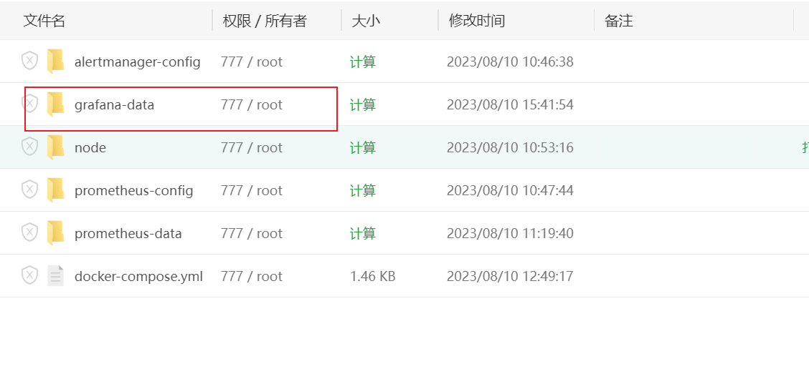

### prometheus + grafana

```
#参考：
https://juejin.cn/post/7110609685354381319
https://github.com/digitalstudium/grafana-docker-stack/blob/main/docker-compose.yml
```

### 创建一个yml文件的存放位置

```
mkdir -p /home/prometheus 
cd /home/prometheus/
```

### 相关配置文件

```
global:
  scrape_interval: 15s
  evaluation_interval: 15s

scrape_configs:
  - job_name: 'prometheus'
    static_configs:
      - targets: ['localhost:9090']

      
  - job_name: 'kuai_admin'
    static_configs:
      - targets: ['38.6.179.81:9100']  # 根据实际情况设置
    relabel_configs:
      - source_labels: [__address__]
        target_label: instance
        replacement: '38.6.179.81'
        
  - job_name: 'kuai_sql'
    static_configs:
      - targets: ['38.6.179.105:9100']  # 根据实际情况设置
    relabel_configs:
      - source_labels: [__address__]
        target_label: instance
        replacement: '38.6.179.105'       
        
  - job_name: 'nginx'
    static_configs:
      - targets: ['38.6.179.81:9113']

```


###  上传 docker-compose 并运行

```
docker-compose up -d

docker-compose.yml 见后边
```

### 修改挂载文件夹权限为777

-  运行后`grafana` 这个会报`/var/lib/grafana`文件没有权限

  

### 访问

```
http://ip:9001   # 端口 看自己在docker中的映射
```


### 被监控主机 部署node_exporter

监控硬件信息

- 端口9100

````
#下载
wget https://github.com/prometheus/node_exporter/releases/download/v1.3.1/node_exporter-1.3.1.linux-amd64.tar.gz

# 创建文件夹
cd /home && mkdir node_exporter

# 解压
tar -zxvf node_exporter-1.3.1.linux-amd64.tar.gz -C /home/node_exporter/

# 配置启动
vi /usr/lib/systemd/system/node_exporter.service


# node_exporter.service 配置
```
[Unit]
Description=node_exporter
After=network.target 

[Service]
ExecStart=/home/node_exporter/node_exporter-1.3.1.linux-amd64/node_exporter --web.listen-address=:9100
Restart=on-failure

[Install]
WantedBy=multi-user.target

```

# 让配置生效 
systemctl daemon-reload
# 自启动
systemctl enable node_exporter


# 启动node_exporter服务
systemctl start node_exporter
# 查看状态
systemctl status node_exporter

systemctl restart node_exporter

````

###  访问

```
http://ip:9100

# 每个监控主机，都可以通过这个看是否配置成功
```

 


### 被监控主机 部署 Nginx Exporter  

还待测试

- 端口 9113

````
# 下载
wget https://github.com/nginxinc/nginx-prometheus-exporter/releases/download/v0.11.0/nginx-prometheus-exporter_0.11.0_linux_amd64.tar.gz

# 创建文件夹
cd /home && mkdir nginx_exporter

# 解压
tar -zxvf nginx-prometheus-exporter_0.11.0_linux_amd64.tar.gz -C ./home/nginx_exporter

# 创建 Nginx Exporter 用户： 为了安全起见，创建一个专门的用户来运行 Nginx Exporter：
sudo useradd -rs /bin/false nginx_exporter

# 配置启动
vi /usr/lib/systemd/system/nginx_exporter.service


```
[Unit]
Description=Nginx Prometheus Exporter
After=network.target

[Service]
User=nginx_exporter
ExecStart=/home/nginx_exporter/nginx-prometheus-exporter  --web.listen-address=:9113

[Install]
WantedBy=multi-user.target

```

# 让配置生效 
systemctl daemon-reload

# 启动nginx_exporter服务
systemctl start nginx_exporter
# 查看状态
systemctl status nginx_exporter
# 重启
systemctl restart nginx_exporter
````


### 防火墙增加9100端口

```
firewall-cmd  --list-all

# 添加端口 centos 
firewall-cmd --zone=public --add-port=9100/tcp --permanent

# 重新加载防火墙规则
firewall-cmd --reload
```


### 查看容器状态

```shell
# 查看容器启动状态
docker-compose ps
#查看容器启动日志
docker-compose logs

# 查看容器启动的进程
docker-compose top

# 容器停止、启动、删除、构建命令
docker-compose stop
docker-compose start
docker-compose down
docker-compose up -d
注：-d参数为后台运行
```

###  配置 prometheus.yml

```
global:
  scrape_interval: 15s
  evaluation_interval: 15s

scrape_configs:
  - job_name: 'prometheus'
    static_configs:
      - targets: ['localhost:9090']

      
  - job_name: 'kuai_admin'
    static_configs:
      - targets: ['ip:9100']  # 根据实际情况设置
    relabel_configs:
      - source_labels: [__address__]
        target_label: instance
        replacement: 'ip'
        
  - job_name: 'kuai_sql'
    static_configs:
      - targets: ['ip:9100']  # 根据实际情况设置
    relabel_configs:
      - source_labels: [__address__]
        target_label: instance
        replacement: 'ip'       
        
  - job_name: 'nginx'
    static_configs:
      - targets: ['nginx服务器的ip:9113']

```


### 配置所有可以看到


### 访问Grafana

```
http://ip:9000/

admin
sqa123456

# 账号密码：
# 在docker配置文件里，根据需要自己修改
```

### 添加数据 add data source


#### 选择prometheus


#### 添加prometheus的服务器IP地址


- 其他的都是默认，保存即可


### explore可以看到刚才添加的prometheus数据


### 配置Dashboards界面

```
# 官方模块地址：
https://grafana.com/grafana/dashboards/
```


### 回到Grafana，在Dashboards中，选择Import


### 最终效果


### docker-compose.yml

```
version: '3'

services:
  prometheus:
    image: prom/prometheus
    container_name: prometheus
    ports:
      - 9001:9090
    volumes:
      - ./prometheus-config:/etc/prometheus
      - ./prometheus-data:/prometheus
    command:
      - --config.file=/etc/prometheus/prometheus.yml
    networks:
      - monitoring

  grafana:
    image: grafana/grafana
    container_name: grafana
    ports:
      - 9000:3000
    environment:
      - GF_SECURITY_ADMIN_USER=admin
      - GF_SECURITY_ADMIN_PASSWORD=sqa123456
    volumes:
      - ./grafana-data:/var/lib/grafana
    networks:
      - monitoring


  node-exporter:
    image: prom/node-exporter:v1.3.1
    ports:
      - "9100:9100"
    volumes:
      - ./node/proc:/host/proc:ro
      - ./node/sys:/host/sys:ro
      - ./node/:/rootfs:ro
    command:
      - '--path.procfs=/host/proc'
      - '--path.sysfs=/host/sys'
      - '--collector.filesystem.mount-points-exclude'
      - '^/(sys|proc|dev|host|etc|rootfs/var/lib/docker/containers|rootfs/var/lib/docker/overlay2|rootfs/run/docker/netns|rootfs/var/lib/docker/aufs)($$|/)'
      
# 告警配置 先不使用
  # alertmanager:
  #   image: prom/alertmanager
  #   container_name: alertmanager
  #   ports:
  #     - 9093:9093
  #   volumes:
  #     - ./alertmanager-config:/etc/alertmanager
  #   command:
  #     - --config.file=/etc/alertmanager/config.yml
  #   networks:
  #     - monitoring

networks:
  monitoring:


```

